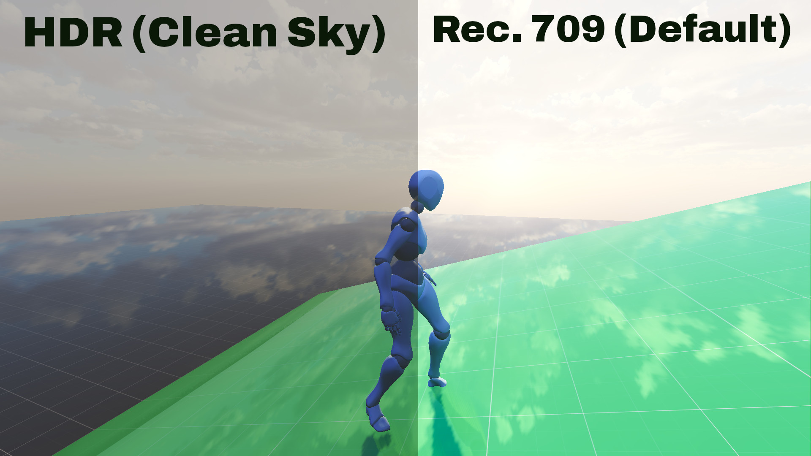
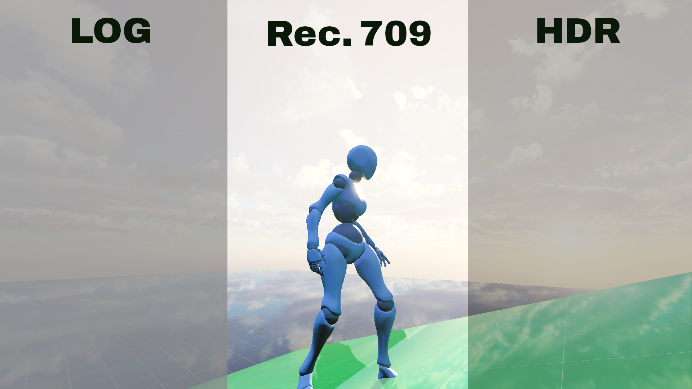
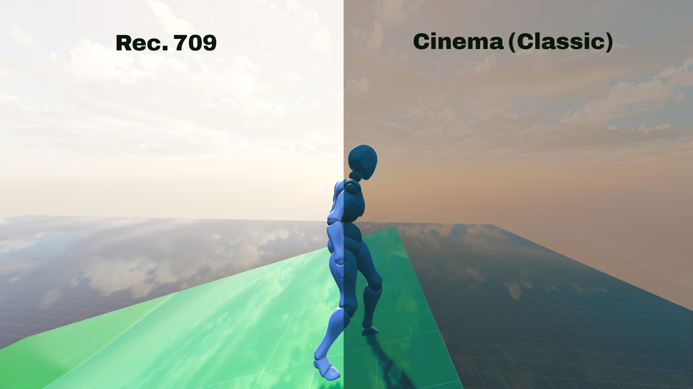

# XCameraControler


Is an open source control Panel made for godot 4 game engine in order to provide the game developers quick yet powerful GUI To implement in their own games.

`XCameraControler` exposes direct engine settings into the game with a peaceful GUI for the players to tweak the settings directly in the game and achieve the looks they want.

`XCameraControler` also exposes the real LOG Curves for content creators who want to get better compatibility with LUTs (Look Up Tables) to color grade the image later.

## How to use ?
This repository hosts the addons directory of the `XCameraControler`. Download or clone the repository:

```bash
git clone https://github.com/darkyboys/xcameracontroler
```

Then copy the `addons` directory and paste it into your project's root. 
 - Once done open your project in godot.
 - Open the `addons` directory in the explorer
 - Open the `XCameraControls` directory
 - Drag and drop the `x_camera_controls_ui.tscn` file into the scene where you want the gui to be
 - In the inspector panel and assign your world environment (Critical to make the Controler work)
 
And Then simply enjoy.

## How to contribute ?
All the types of contributions are accepted from just the GUI tweaks to programming.
 - Clone / fork the repository
 - Make your changes
 - Make a pull request and wait for the approval

> One quick note: Do not use any 3rd party assets. Only your own or the project's builtin assets are allowed because the entire project is under the CC0 License which includes the assets as well.
 
## License
This project is proudly under the Public Domain (CC0 License)
Why ? Because now developers don't have to worry about crediting anyone. They can use the project how ever they want.

## What is Rec. 709
In simple terms the `Rec. 709` is the normal picture output that we usually see on our display as the finished image. Most games , softwares and movies eventually are played in the `Rec. 709` Color space (In simple terms).

## What is a LOG ?
In traditional sence the LOG is a flat gamma curve applied at the sensor level during video recording to preserve the dynamic range for later color grading. This is used in professional cameras and cinema workflows. Most of us uses LUTs (Look Up Tables) To convert LOG Into Rec. 709 color space with the intended color transformations which makes the grading easier for us but the problem with most cinema LUTs is that they expects flatter images where as our games are usually very colorfull. Now this is fine for most people but the problem occurs when content creators are playing a game (eg a racing game) and they want to later color grade the game. Now they can't directly apply most cinema LUTs because they will oversaturate the image and explode the contrast. Usual fixes are lowering the saturation and contrast but they are still not the perfect ways to do grading. That's where the pseudo LOG Comes. A Pseudo LOG is nothing but a gamma curve which is applied during POST Processing By the game or the software to give the flatter and color grading friendly images. 

The `XCameraControler` exactly exposes these pseudo LOG Curves which provides you actually higher dynamic range and real log gamma curves at the engine level so that you can color grade them. 

Now the question occurs. Are they real LOG ? 
And the answer is: Traditionally NO. Because traditionally a LOG is a gamma curve which is applied by cameras at the sensor level during video recording. But games are not cameras hence they can't have a true traditional LOG directly. That's why these Pseudo logs exists and are exposed by the `XCameraControler` to the game developers and the players directly.

 > Note: If you are confused then keep using `tlogk` or use `glog1` (Stronger gamma curve) in the log selection menu. And note that LOG Are intended for content creators who want to color grade the footage later. They aren't intended to be played with.

## What is HDR ?
`HDR` In `XCameraControler` stands for **High Dynamic Range** (Dynamic range is the difference between the brightest and the darkest area in an image. Example: If you stand in front of a window from where sunlight is directly comming and someone is picking your photo then how well the camera can show the window's background and you at the same time is what we calls a dynamic range. Eg: If the window becomes completely white but you are focused by the camera then that's what we calls a low dynamic range but if the camera can capture both you and the background of the window then that's what we calls higher dynamic range. In simple terms the higher the dynamic range is that higher the details in an image can be and vice-versa). `HDR` in `XCameraControler` allows the players to play with high dynamic range output at the engine level so the players can see more detailed shadows , Lesser exploded sky without impacting the performance a lot. It's not going to give as high dynamic range as LOG Recording gives you but it keeps the game visually playable while giving you higher dynamic range (Better details overall) than Rec. 709. It depends on the players and the developers what they want to use.

There may be multiple `HDR` tonemappings. The best one or the mapping i recommend is `ghdr0` (It's also the default so you don't need to worry)

> Note: HDR may make dark scenes look brighter and that's expected and shouldn't be reported as a bug to the `XCameraControler` project

## What is Cinema ?
`Cinema` in `XCameraControler` refers to the Look Up Tables (LUTs) which comes with the project `XCameraControler` made by me (darkyboys) in order to to give players the cinema feel without having to color grade themselves. They were mainly implemented for players to play the game with cinematic aesthetics because LOG exists but it is only usable for video editors who want to color grade to footage. HDR Also exists which gives better visual dynamic range but the problem is still the colors. HDR gives you incredible details sure but the problem is that the colors that you get after color grading are different from HDR and in order to give that color grading look the project introduced these LUTs. Which transforms the game's Aesthetics into pre graded output. These LUTs also follows the CC0 License as they are the part of the project.

## Differences between the LOG, Rec. 709 and HDR




## Some Screen Shots


