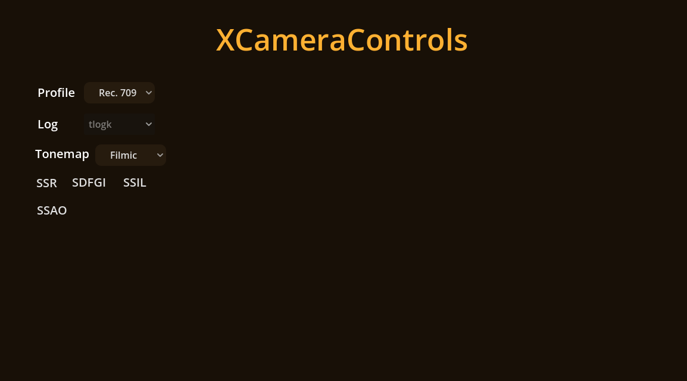
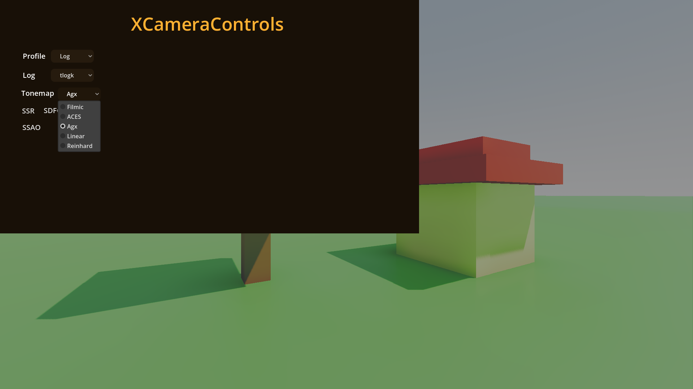
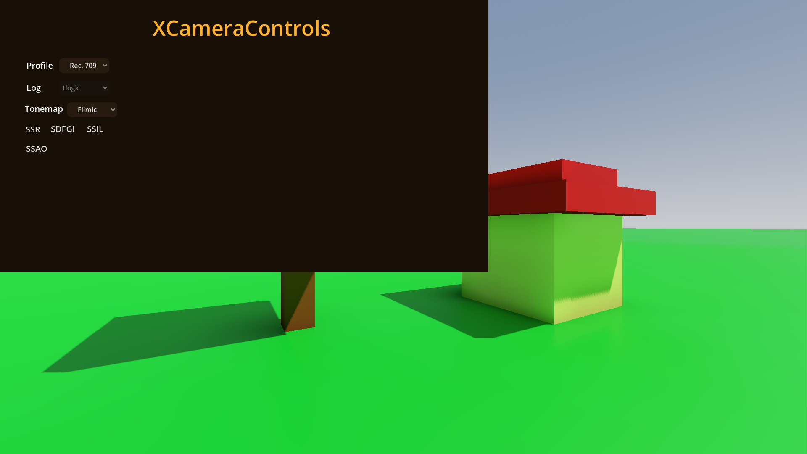

# XCameraControler


Is an open source control Panel made for godot 4 game engine in order to provide the game developers quick yet powerful GUI To implement in their own games.

`XCameraControler` exposes direct engine settings into the game with a peaceful GUI for the players to tweak the settings directly in the game and achieve the looks they want.

`XCameraControler` also exposes the real LOG Curves for content creators who want to get better compatibility with LUTs (Look Up Tables) to color grade the image later.

## How to use ?
This repository hosts the addons directory of the `XCameraControler`. Download or clone the repository:

```bash
git clone https://github.com/darkyboys/xcameracontroler
```

Then copy the `addons` directory and paste it into your project's root. 
 - Once done open your project in godot.
 - Open the `addons` directory in the explorer
 - Open the `XCameraControls` directory
 - Drag and drop the `x_camera_controls_ui.tscn` file into the scene where you want the gui to be
 - In the inspector panel and assign your world environment (Critical to make the Controler work)
 
And Then simply enjoy.

## How to contribute ?
All the types of contributions are accepted from just the GUI tweaks to programming.
 - Clone / fork the repository
 - Make your changes
 - Make a pull request and wait for the approval

> One quick note: Do not use any 3rd party assets. Only your own or the project's builtin assets are allowed because the entire project is under the CC0 License which includes the assets as well.
 
## License
This project is proudly under the Public Domain (CC0 License)
Why ? Because now developers don't have to worry about crediting anyone. They can use the project how ever they want.

## Some Screen Shots



